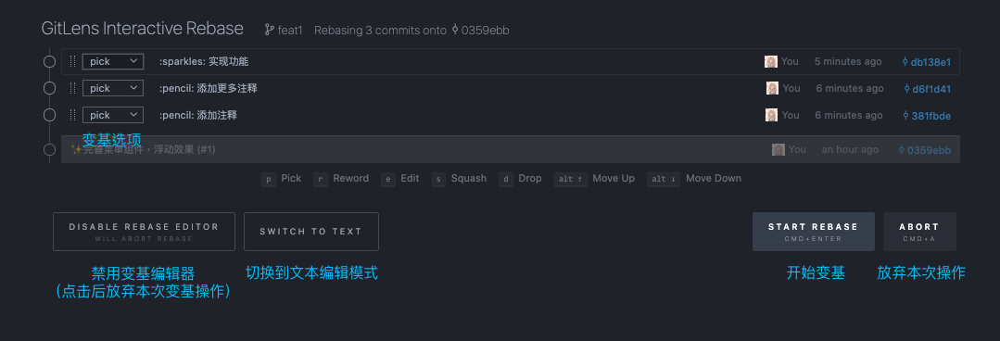
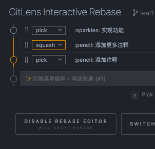

---
tags:
  - 开发/Git
  - 命令行/git
  - 命令行/git/操作
  - 命令行/git/历史
  - 命令行/git/变基
  - 命令行/git/Stash
  - 网站/GitHub
  - 软件/Visual-Studio-Code/vscode
  - 软件/Visual-Studio-Code
---
# 使用变基和堆叠整合提交和拉取请求

## 为什么用堆叠提交和变基？

### 都有什么操作模式？

如果使用 GitHub 默认的拉取请求合并模式，将会发生下面的步骤

1. 把我们目前的提交全部放到合并的基准分支（如果拉取请求是从 dev 合并到 main 的话，则 main 分支就是基准分支）里面
2. 连带创建一个新的提交说明本次合并的来源分支和基准分支

#### 好处

1. 简单易用，不需要掌握复杂的 git 命令就可以直接执行，现有的绝大多数自动化工具在本地也是这样合并的
2. 可以保留每一个 PR 的独立提交的变更和提交信息

#### 坏处

1. 如果开发人员不好好整理提交信息，将会有大量的垃圾提交信息和重复无用的提交记录（比如提交 1 改了某个地方，提交 2 又改回去）被同步到主分支上，造成管理混乱
2. 回滚的时候也会遇到很多麻烦
3. 每次都会多一条「合并提交: 从 xxx 到 xxx 的合并」这样的提交记录，如果在多个分支、多个拉取请求中维护代码，最终合并到主分支上的时候都会多很多这样的一条垃圾信息（但其实是完全可以合并的）
4. 协同开发的时候每次都会多各种乱糟糟的提交信息

### 堆叠并合并模式

这个也是其中一种 GitHub 拉取请求中的合并模式，将会发生以下步骤

1. 我们所有的提交（在同一个 PR 中的）都会被堆叠为一个提交，合并前的每一条记录都会自动写入到堆叠后的提交信息的详细说明中
2. 把这个提交放到合并的基准分支（如果拉取请求是从 dev 合并到 main 的话，则 main 分支就是基准分支）里面
3. 一般而言，会删除合并用的分支

#### 好处

1. 可以重新整理我们的提交信息和提交记录，整合好之后，可以根据功能块分类提交
2. 美观，整洁
3. 无论开发人员如何提交，最终都会变成一条提交记录
4. 协同开发的时候除非遭遇冲突，否则不用一直去同步别人的分支，只需要和主分支保持同步即可

#### 坏处

1. 依然会创建额外的提交信息，一般使用 PR 的标题作为这一条提交的信息进行提交
2. 同步和更新会变得更困难
3. 回滚的时候无论是回滚拉取请求还是会滚提交，都是等效的
4. 提交、贡献数量都不会被完整保留，一个 PR 只产生一条提交

### 变基合并模式

这个也是其中一种 GitHub 拉取请求中的合并模式，将会发生以下步骤

1. 把我们所有的提交（在同一个 PR 中的）全部原位放到基准分支里面

#### 好处

1. 操作起来没有难度，可以完整保留提交记录
2. 不会多任何的额外提交记录

#### 坏处

1. 如果开发人员不好好整理提交信息，将会有大量的垃圾提交信息和重复无用的提交记录（比如提交 1 改了某个地方，提交 2 又改回去）被同步到主分支上，造成管理混乱
2. 回滚的时候也会遇到很多麻烦
3. 同步和更新会变得更困难

综上所述，

1. 对于协同开发的项目而言，堆叠合并看上去会更好，多人协同的时候会舒服很多

2. 对于一个人的项目而言，如果要依赖 PR，那可以使用第三种合并模式，把自己所有的提交都完整保留下来

### 如何应用堆叠合并？

合并的时候选择 **Squash and Merge** 即可。

### 本地如何同步代码？

如果你当前在 dev 分支开发，你需要和上游分支同步，比如你想同步 main 的代码到 dev 分支：

1. 如果是在仓库内创建的分支，可以按照如下步骤操作

```shell
git checkout main # 切换到 main 分支，操作前都确保你在你需要更新的分支上，要不然数据就覆盖了
git pull origin main # 拉取源 -> main 分支的所有更新数据到本地的 main
git checkout dev # 切换到 dev 分支
git rebase origin/main # 把 main 分支变基到 dev 上，这个操作将会在 dev 分支上应用所有 main 分支上新增的提交
```

这个时候如果遇到说 CONFLICT（冲突），打开对应的编辑器然后在里面进行操作就好了

如果你进行了很多文件的变更，遇到冲突的时候可能会出现某种奇怪的现象：解决冲突的界面中，传入的变更是自己还没有完整实现的代码，这个时候尽量筛选一下自己的代码，能保留多少就保留多少，不用把剩下没写完的代码补充完，之后继续运行

```shell
git rebase --continue # 继续进行变基操作
```

如果中途你觉得有问题了不对了，可以用下面的命令取消

```shell
git rebase --abort # 放弃变基操作，无论处理了多少的提交都会被放弃
```

如果你想要跳过某个提交，可以用下面的命令跳过

```shell
git rebase --skip
```

一直到你看到 Successfully *** 这样的字样结束

2. 如果是复刻出来的仓库内的分支，可以按照如下步骤操作

```shell
git remote add upstream <原始的仓库链接地址（不是复刻出来的那个）> # 这一步用于创建对仓库的引用，upstream 表示上游，这个字符串可以替换为自己喜欢的，相当于别名，如果你已经创建过引用了就会报错，不用管这步就好

git checkout main # 切换到 main 分支，操作前都确保你在你需要更新的分支上，要不然数据就覆盖了
git pull upstream main # 拉取 upstream -> main 分支的所有更新数据到本地的 main，upstream 是你的标签，根据你之前创建的引用按需替换字符串
git checkout dev # 切换到 dev 分支
git rebase upstream/main # 把 main 分支变基到 dev 上，这个操作将会在 dev 分支上应用所有 main 分支上新增的提交，upstream 是你的标签，根据你之前创建的引用按需替换字符串
```

这个时候如果遇到说 CONFLICT（冲突），打开对应的编辑器然后在里面进行操作就好了

如果你进行了很多文件的变更，遇到冲突的时候可能会出现某种奇怪的现象：解决冲突的界面中，传入的变更是自己还没有完整实现的代码，这个时候尽量筛选一下自己的代码，能保留多少就保留多少，不用把剩下没写完的代码补充完，之后继续运行

```shell
git rebase --continue # 继续进行变基操作
```

如果中途你觉得有问题了不对了，可以用下面的命令取消

```shell
git rebase --abort # 放弃变基操作，无论处理了多少的提交都会被放弃
```

如果你想要跳过某个提交，可以用下面的命令跳过

```shell
git rebase --skip
```

一直到你看到 Successfully *** 这样的字样结束

### 使用变基来进行本地堆叠和编辑过去提交历史

不仅仅是在拉取请求的时候可以进行堆叠，在本地的时候也可以进行堆叠操作。

如果你还没有配置过你的 git 默认编辑器，macOS 可以使用这个命令配置

```shell
sudo git config --global core.editor "code -w --reuse-window"
```

Windows 安装 GitBash 的话现在应该会自动设定编辑器为 Visual Studio Code，如果没有，可以进行下面的操作：

```shell
git config --global core.editor "'C:\Program Files\Microsoft VS Code\code.exe' -n -w" # 路径不一定相同，注意替换一下
```

本地操作的话，可以执行：

```shell
git rebase -i origin/main # -i 参数表示使用交互模式进行操作，操作时基准分支为 源 -> main，会对比当前分支和 main 的区别
```

如果你没有别的分支可以对比了，也可以根据提交哈希来确定一个范围

```shell
git rebase -i <提交哈希> # 变基操作的时候，会把当前最后一次提交一直到你指定的提交哈希之前的提交全部包括进来
```

执行之后 Visual Studio Code 应该会打开类似的界面方便操作：


变基选项有这么几种，根据自己需要来选择：

- **pick**，是最基本的默认行为。一般 rebase（变基）的时候都会把每个提交都默认选择为 `pick`，意味着就是将会在 rebase（变基）之后复制该提交到目标分支
- **reword** 在 `pick` 的基础上，修改该提交的提交信息，当使用该命令时，打开 commit 消息编写文件，让我们写新的提交信息。在我们想修改 commit 的提交信息时，可以选择使用这个方法
- **edit** 在 `pick` 的基础上，当 rebase（变基）进行到这一个提交时，中断 rebase（变基）流程，中断后，我们可以修改工作区文件，修改完以后通过 `git add . => git commit --amend` 就能进行重新提交。提交完后使用 `git rebase --continue` 就可以继续变基。当我们想修改某个提交的代码时，可以选择使用这个方法
- **squash** 合并提交，它会合并到前面的提交中，然后让我们重新编辑提交信息，这也是我们要实现的。
- **fixup** 在 `squash` 的基础上，不会让我们重新编辑提交信息，而是直接使用前面的提交信息
- **drop** 丢弃该提交，意味着，在 rebase（变基）之后，该提交就不会应用并出现在目标分支上
- **exec** 执行 `shell` 命令，不知道有什么用

#### 堆叠

对于本地堆叠提交，我们这里需要用 squash（堆叠），在下拉选项中选择 squash：



这个地方就可以发现中间的节点不见了，这个操作会把 squash 下方的提交合并到 squash 标记的提交。
弄好之后点 start rebase 就可以开始，弄好之后会自动结束。

#### 编辑历史提交

如果你想变更自己的历史提交，下拉菜单选择 edit，然后就可以在源代码管理的插件编辑了，输入命令来编辑

```shell
git commit --amend
```

会弹出一个专门的标签页来编辑，编辑好之后 <kbd data-macos-keyboard-key="command">command</kbd> + <kbd>W</kbd>（macOS）或者 <kbd data-keyboard-key="control">ctrl</kbd> + <kbd>W</kbd>（Windows 和 Linux）关闭编辑器标签页，输入下面的命令继续你的变基操作

```shell
git rebase --continue
```
